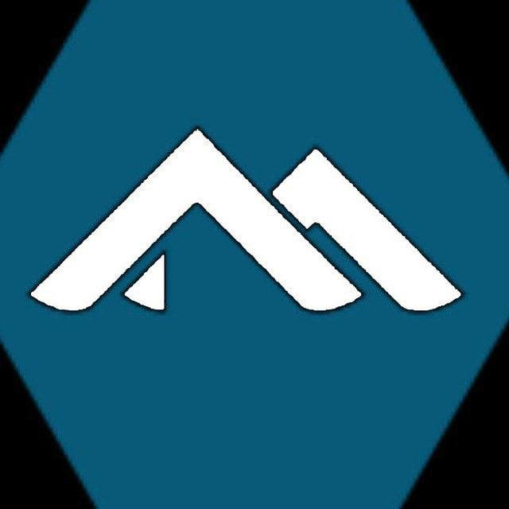

  

# alpine_wiki

This is a markdown-based effort to provide a non-minimalist documentation 
for the minimalist operating system [Alpine Linux](alpine/about.md);
a Linux distribution based upon the [Musl LibC](alpine/base-with-muslc-and-busybox.md#base-with-muslc) 
and defaults commands to [Busybox](alpine/base-with-muslc-and-busybox.md#defaults-to-busybox)
but not limited to only those options.

Where to start? Check the [Tutorials and Docs](#tutorials-and-docs) section. [This is not an official project](alpine/copyright.md)

How to contribute to this project? Check the [How to contribute](#how-to-contribute) section.

### About alpine

* [Alpine Linux Overview](alpine/README.md)
* [Comparison with other distros](alpine/comparison-with-other-distros.md)
* [Alpine Linux Releases](alpine/releases.md)

### Tutorials and Docs

* [Newbies](newbie/README.md)
* [Tutorials](tutorials/README.md)

### How to contribute

* [Contribution.md](alpine/contribution.md)

### Social network and contact

- 🗯 IRC
  - 💬 `##alpine_telegram_english`
  - 💬 `#alpine_linux_english`
- 📱 Telegram https://t.me/alpine_linux
  - 🇬🇧 https://t.me/alpine_linux_english
  - 🇷🇺 https://t.me/alpine_linux_pycckuu (dual english russian, low activity)
  - 🇨🇴 https://t.me/alpine_linux_espanol
  - 🇧🇬 https://t.me/alpine_linux_bulgarian (dual english bulgarian, low activity)
  - 🇨🇳 https://t.me/alpine_linux_chinese (dual english chinese, low activity)
  - 📡 https://t.me/opentechnologies (open languajes but english as main)
- Matrix
  - 👥 https://matrix.to/#/#alpine-linux-english:matrix.org

# LICENSE

**CC BY-NC-SA**: the project allows reusers to distribute, remix, adapt, and build upon the material 
in any medium or format for noncommercial purposes only, and only so long as attribution is given 
to the creators involved. If you remix, adapt, or build upon the material, you must license the modified 
material under identical terms,  includes the following elements:

* **BY**  – Credit must be given to the creator of each content respectivelly, starting at the first contributor.
* **NC**  – Only noncommercial uses of the work are permitted, with exceptions if you fill an issue here!
* **SA**  – Adaptations must be shared under the same terms, you must obey this terms and do not change it.

For more information check the [alpine/copyright.md](alpine/copyright.md)

